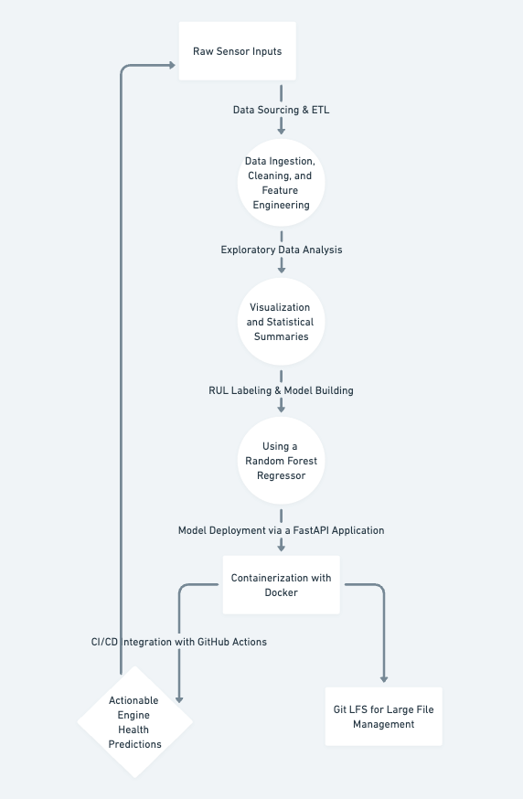

# Predictive Maintenance for Turbofan Engines

*An end-to-end predictive maintenance solution harnessing sensor data and machine learning to forecast engine health and optimize maintenance schedules.*

---

## Project Overview

Predictive maintenance is essential for reducing unexpected equipment failures and optimizing maintenance schedules. This project leverages sensor data from turbofan engines to predict the Remaining Useful Life (RUL) of each engine, allowing for proactive maintenance that minimizes downtime and costs.

---

## Data Story

### Aim & Goal

- **Aim:** Develop a data-driven system to predict engine failures before they occur.
- **Goal:** Use sensor data to forecast the RUL of turbofan engines, enabling timely maintenance interventions.

### Problem Statement

Turbofan engines operate under extreme conditions and are prone to unexpected failures if not properly maintained. Traditional maintenance schedules often lead to either premature servicing or sudden breakdowns. With vast amounts of sensor data available, the challenge is to extract meaningful insights to accurately predict when an engine will require maintenance.

### Our Solution

We built an end-to-end pipeline that includes:

1. **Data Ingestion & ETL:**
   - Loading raw sensor data.
   - Cleaning and performing feature engineering (e.g., calculating the average sensor readings).

2. **Exploratory Data Analysis (EDA):**
   - Visualizing data distributions and time-series trends to gain insights into engine behavior.

3. **Labeling & Model Building:**
   - Computing RUL labels from historical sensor data.
   - Training a Random Forest model to predict RUL based on operational settings and sensor data.

4. **Deployment:**
   - Exposing the trained model via a FastAPI application.
   - Containerizing the application using Docker for consistency and portability.

5. **CI/CD Integration:**
   - Automating testing, building, and deployment using GitHub Actions.
   - Using Git LFS to manage large model files seamlessly.

### Impact

This solution enables real-time monitoring of engine health, allowing for proactive maintenance scheduling. The approach not only improves operational efficiency but also enhances safety by reducing the risk of unexpected engine failures.

---

## Workflow Diagram

Below is a high-level diagram that outlines the entire project workflow:



*Note: The diagram illustrates the flow from raw sensor data ingestion, through ETL, EDA, model training, deployment via FastAPI, containerization with Docker, and CI/CD integration with GitHub Actions.*

---

## Key Skills & Technologies

- **Data Engineering & ETL:** Python, Pandas, NumPy
- **Exploratory Data Analysis:** Matplotlib, Seaborn
- **Machine Learning:** Scikit-learn, Random Forest Regressor
- **Model Deployment:** FastAPI, Uvicorn
- **Containerization:** Docker, Git Large File Storage (Git LFS)
- **CI/CD:** GitHub Actions, Automated Testing with Pytest
- **Version Control:** Git, GitHub

---

## Installation & Setup

### Prerequisites

- Python 3.9+
- Docker
- Git & Git LFS
- GitHub account

### Steps

1. **Clone the Repository:**
   ```bash
   git clone https://github.com/asadkhan5456/predictive_maintenance.git
   cd predictive_maintenance

2. **Set Up Python Environment:**
   ```bash
   python3 -m venv env
  source env/bin/activate
  pip install -r requirements.txt

3. **Run the ETL Pipeline and EDA:**
   ```bash
   python main.py
   
4. **Run the API Locally:**
   ```bash
   uvicorn app:app --reload
   Visit http://localhost:8000 to see the welcome message.

5. **Build & Run with Docker:**
    ```bash
    docker build -t predictive-maintenance-api .
    docker run -d -p 8000:8000 predictive-maintenance-api
    
6. **CI/CD:**
   The GitHub Actions workflow in .github/workflows/docker_build.yml automatically tests, builds, and deploys changes on each push to the main branch.

### Usage

 **API Endpoints**:
- GET / : Returns a welcome message.
- POST /predict : Accepts JSON payload with features (op_setting1, op_setting2, op_setting3, sensor_avg) and returns the predicted RUL.

### Contributing

Contributions are welcome! Please fork the repository and open a pull request for any enhancements or bug fixes.

### License

This project is licensed under the MIT License.
    
### By leveraging modern data engineering, machine learning, deployment, and CI/CD practices, this project demonstrates a robust predictive maintenance solution tailored for high-stakes industrial environments.
   

